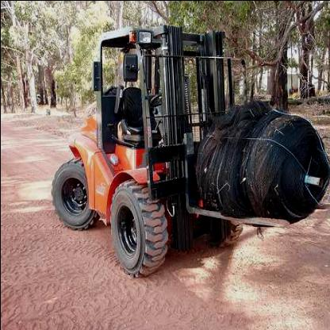
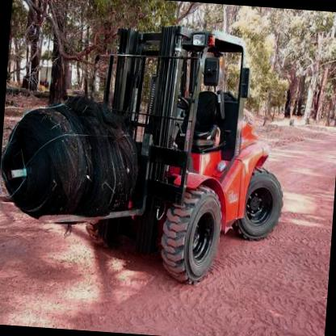
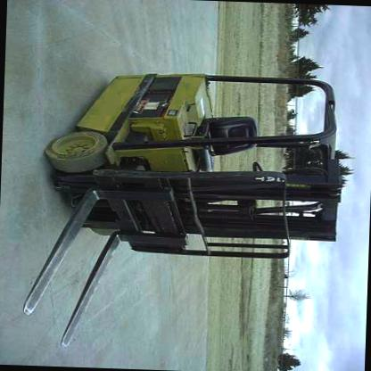
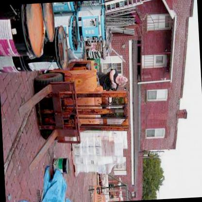

<div align="left">
  <p>
    <a align="left" href="http://egerobot.com.tr" target="_blank">
      </a>
  </p>

  English | [简体中文](.github/README_cn.md)
  <br>
  <div>
    <a href="https://github.com/ultralytics/yolov5/actions/workflows/ci-testing.yml"></a>
    <a href="https://zenodo.org/badge/latestdoi/264818686"></a>
    <a href="https://hub.docker.com/r/ultralytics/yolov5"></a>
    <br>
    <a href="https://bit.ly/yolov5-paperspace-notebook"></a>
    <a href="https://colab.research.google.com/github/ultralytics/yolov5/blob/master/tutorial.ipynb"></a>
    <a href="https://www.kaggle.com/ultralytics/yolov5"></a>
  </div>

## <div align="left">Forklift and Person Recognation From Video</div>
>This project uses yolov5 and custom dataset to detect forklifts and people.  This dataset can also be created by labeling individually, but a custom dataset has been used to save time.

>Some images for training data







## <div align="left">Code</div>

```python3
!git clone https://github.com/ultralytics/yolov5  # clone repo
!pip install -U -r yolov5/requirements.txt  # install dependencies
```
>Custom Dataset
```python3
!pip install roboflow

from roboflow import Roboflow
rf = Roboflow(api_key="djen2bv91273ZmVErkfR")
project = rf.workspace("mohamed-traore-2ekkp").project("forklift-dsitv")
dataset = project.version(5).download("yolov5")
```
```python3
%cd /content/yolov5
```
>Training
```python3
!python train.py --img 640 --batch 16 --epochs 30 --data /content/Forklift-5/data.yaml --weights yolov5x.pt
```
 
  
 


>Results
```python3
!python detect.py --weights runs/train/exp2/weights/best.pt --img 640 --conf 0.25 --source /content/forklift.mp4

```


## <div align="center">Youtube Video</div>
<a href="http://www.youtube.com/watch?feature=player_embedded&v=bAzlnjdmSVg
" target="_blank"></a>
